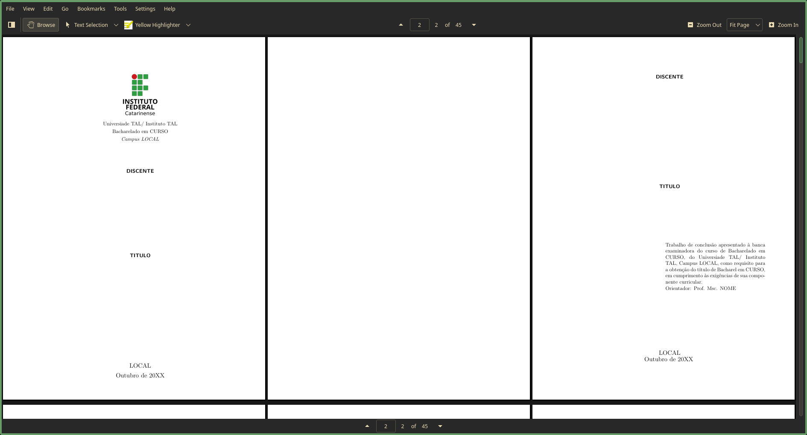
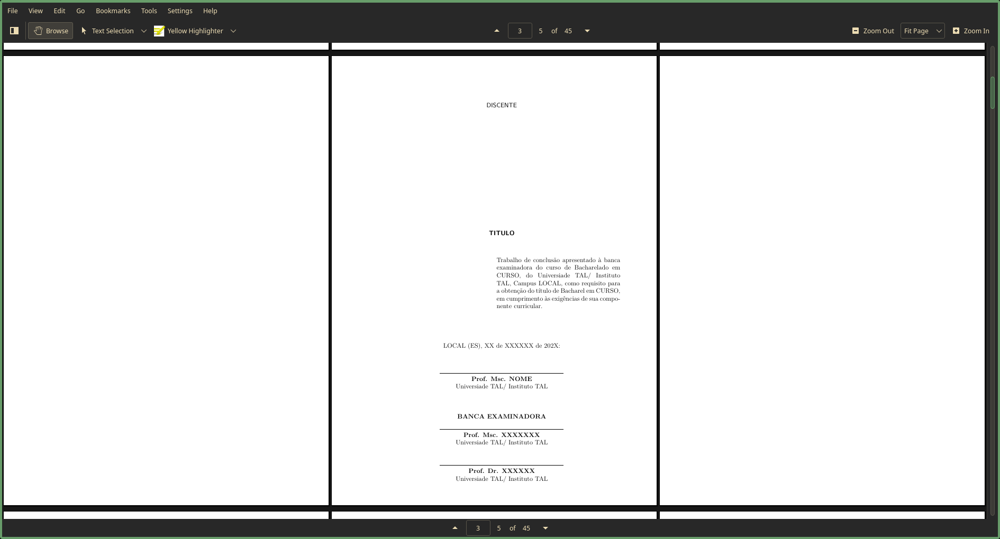
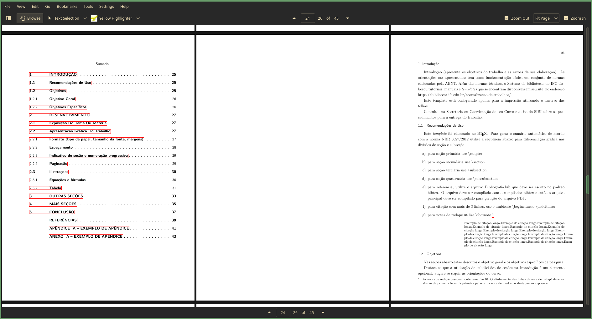
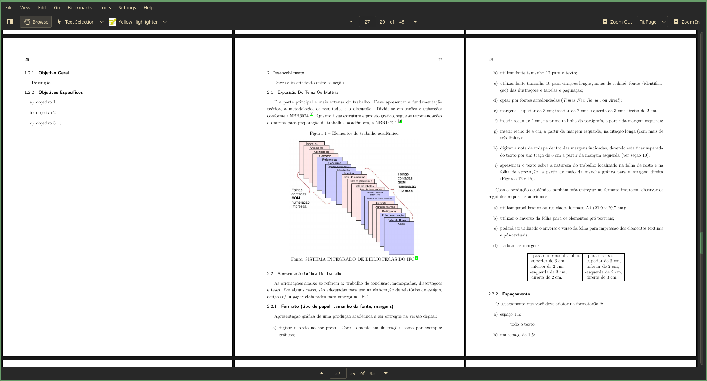

# modelo-tcc-latex

Modelo de TCC em latex segundo as normas de formatação ABNT NBR 14724 e relevantes. Cópias das normas na pasta [abntex-docs](abntex-docs/).

Utiliza lualatex e GNU Make para compilação.

# Sumário
- [modelo-tcc-latex](#modelo-tcc-latex)
- [Sumário](#sumário)
- [Imagens](#imagens)
- [Seções inclusas](#seções-inclusas)
- [Preferências do autor](#preferências-do-autor)
- [Escrever](#escrever)
- [Compilação](#compilação)
	- [Compilação rápida](#compilação-rápida)
	- [Compilação rápida + Synctex](#compilação-rápida--synctex)
	- [Compilação completa (com bibtex)](#compilação-completa-com-bibtex)
	- [Limpar ambiente](#limpar-ambiente)
- [Integração com vscode](#integração-com-vscode)

# Imagens






# Seções inclusas

1. Capa
2. Folha de rosto
3. Folha de aprovação
4. Dedicatória
5. Agradecimentos
6. Epígrafe
7. Resumo
8. Abstract
9. Sumário
10. Introdução
11. Desenvolvimento
12. Metologia
13. Conclusão
14. Bibliografia
15. Apêndices
16. Anexos

# Preferências do autor

1. Fonte padrão latex, *computer modern*.
2. Títulos de capítulos, seções, sub seções e sub sub seções não usam a convenção de maiúsculo negrito, maiúsculo, negrito e itálico, pois não é obrigatória.
3. Citação usando modelo de chaves número, em vez de autor data.
4. Legenda inferior de imagens e tabelas é centralizada em vez de a esquerda.
5. Impressão folha frente e verso, com elementos pré textuais apenas em folhas no anverso e capítulos também.

# Escrever

As seções do trabalho estão na pasta [sections](sections), cada seção tem o mesmo nome do arquivo.

# Compilação

Utilizar GNU Make para compilar. Ver arquivo [Makefile](Makefile).

## Compilação rápida
```console
$ make
```

## Compilação rápida + Synctex
```console
$ make SYNC_LINE={linha arquivo .tex} SYNC_FILE={arquivo fonte .tex}
```

Obs: synctex está configurado para usar o leitor de pdf Okular.

## Compilação completa (com bibtex)
```console
$ make build
```

## Limpar ambiente
```console
$ make clear
```

# Integração com vscode

O repositório já vem com a pasta de configuração [.vscode](./.vscode/), onde está configurada a procura direta e reversa, para já sair utilizando a configuração instale:

* Leitor de pdf [Okular](https://okular.kde.org/pt-br/).
* Vscode, [Visual studio code](https://code.visualstudio.com).
* Extensão vscode, [Code Spell Checker](https://marketplace.visualstudio.com/items?itemName=streetsidesoftware.code-spell-checker).
* Extensão vscode, [Brazilian Portuguese - Code Spell Checker](https://marketplace.visualstudio.com/items?itemName=streetsidesoftware.code-spell-checker-portuguese-brazilian).
* Extensão vscode, [TexLab](https://marketplace.visualstudio.com/items?itemName=efoerster.texlab).